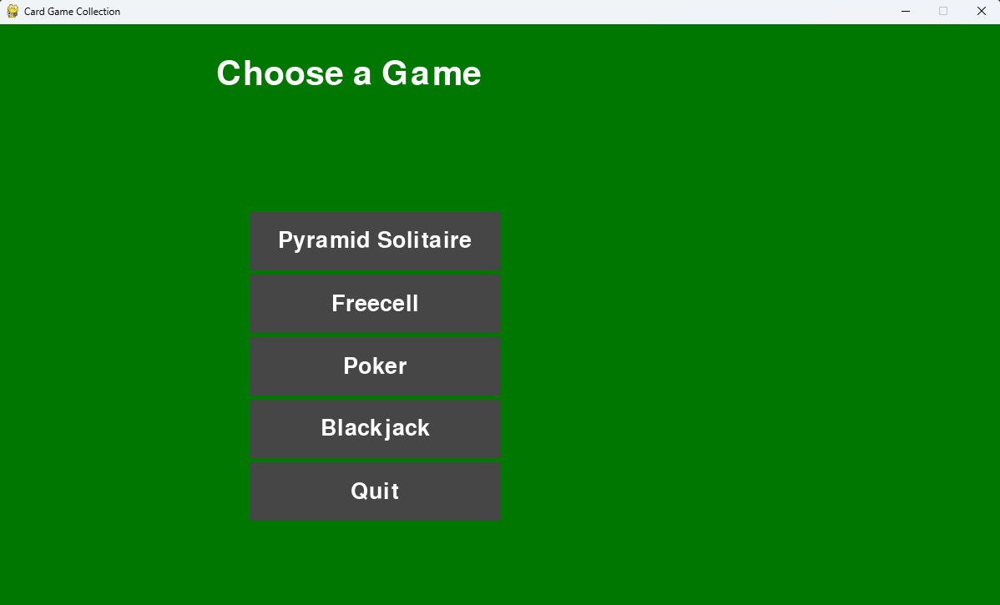

# Final Project
We wanted a place where we could play many card games without having to go to separte, sketchy websites!

This project does just that. Here, you can play poker, blackjack, standard solitaire, pyramid solitaire, and freecell solitaire!

## How to Use
### Things to Install
Before running our program, install the following things
- treys
    - type 'pip install treys' into your terminal
- pygame
    - type 'pip install pygame' into your teminal

Once that is done, head to the main.py file and click the run button!

## Features
- Fun Pygame screens! 🐍
- Pretty card designs ♠️ ♣️ ♥️ ♦️
- Variety of games! 🎮
- High integration of Pygame 🕹️🐍
- Cards saved in json file for easy access 📂

## Contributors
- edwingsantos
- Lizzie42-SandersonFan
- lulu094
- titaniumlizard445